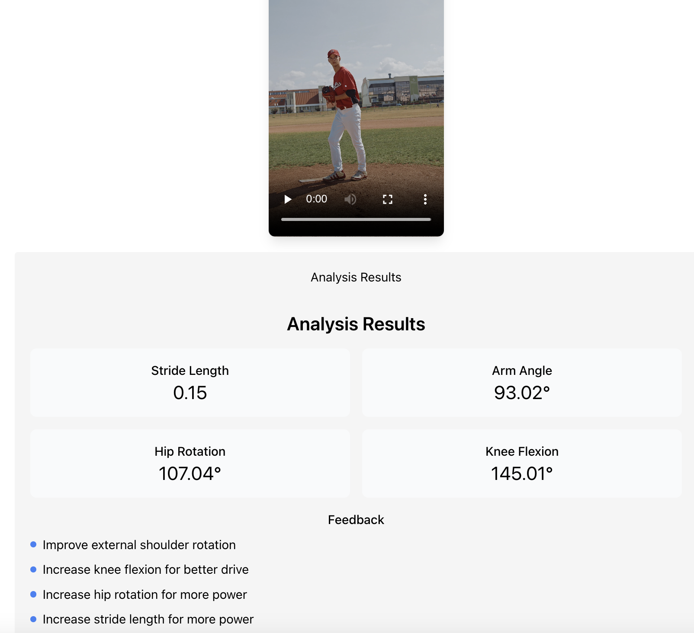

# Pitching Mechanics Analyzer

A web application that analyzes baseball pitching mechanics using computer vision and machine learning. The application provides real-time feedback on various aspects of pitching form, including stride length, arm angle, hip rotation, and knee flexion.

## Features

- Video upload and analysis
- Real-time pose detection using MediaPipe
- Detailed metrics for pitching mechanics
- Visual feedback and recommendations
- Modern, responsive web interface

## Demo



## Tech Stack

- Frontend: React.js
- Backend: FastAPI (Python)
- Computer Vision: MediaPipe
- Video Processing: OpenCV

## Prerequisites

- Python 3.10+
- Node.js 14+
- npm or yarn

## Installation

1. Clone the repository:
```bash
git clone https://github.com/yourusername/pitching-mechanics-analyzer.git
cd pitching-mechanics-analyzer
```

2. Set up the Python virtual environment and install dependencies:
```bash
python -m venv venv_py310
source venv_py310/bin/activate  # On Windows: venv_py310\Scripts\activate
pip install -r requirements.txt
```

3. Install frontend dependencies:
```bash
cd frontend
npm install
```

## Running the Application

1. Start the backend server:
```bash
cd backend
source ../venv_py310/bin/activate  # On Windows: ..\venv_py310\Scripts\activate
python -m uvicorn app.main:app --reload
```

2. Start the frontend development server:
```bash
cd frontend
npm start
```

3. Open your browser and navigate to `http://localhost:3000`

## Usage

1. Upload a video of a pitching motion
2. Wait for the analysis to complete
3. View the detailed metrics and feedback
4. Review recommendations for improvement

## API Endpoints

- `POST /api/analyze-pitch`: Upload and analyze a pitching video
- `GET /api/health`: Check API health status

## Contributing

1. Fork the repository
2. Create your feature branch (`git checkout -b feature/AmazingFeature`)
3. Commit your changes (`git commit -m 'Add some AmazingFeature'`)
4. Push to the branch (`git push origin feature/AmazingFeature`)
5. Open a Pull Request

## License

This project is licensed under the MIT License - see the LICENSE file for details.

## Acknowledgments

- MediaPipe for pose detection
- FastAPI for the backend framework
- React for the frontend framework 